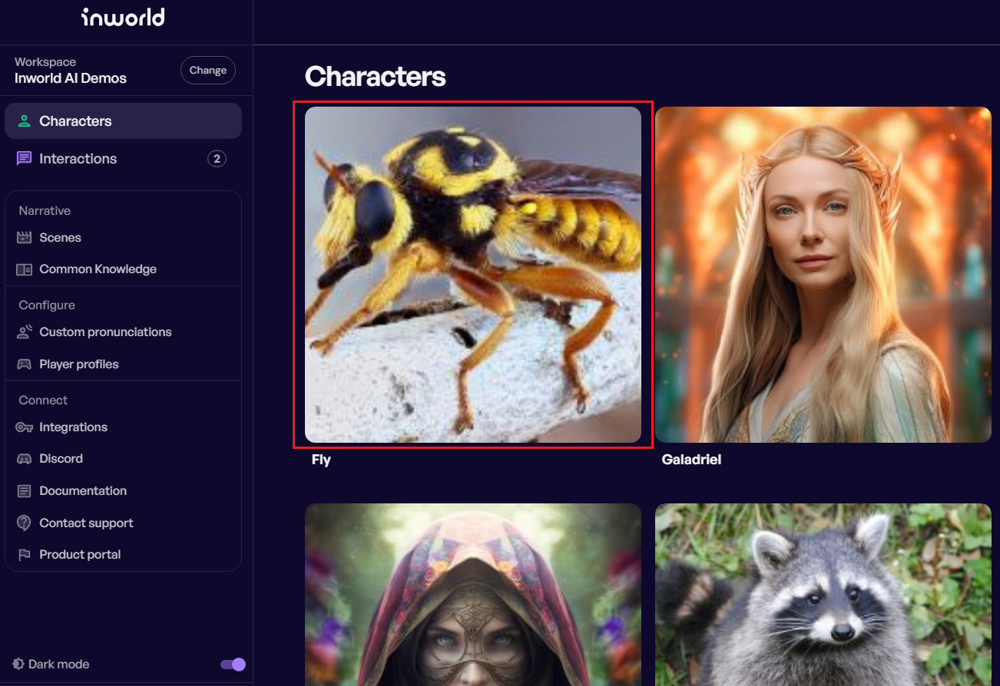
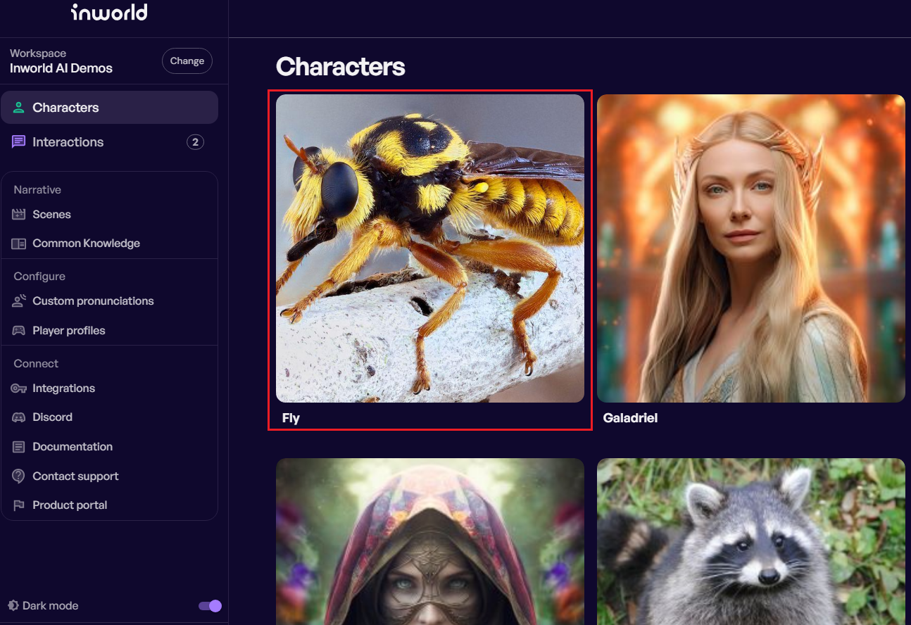
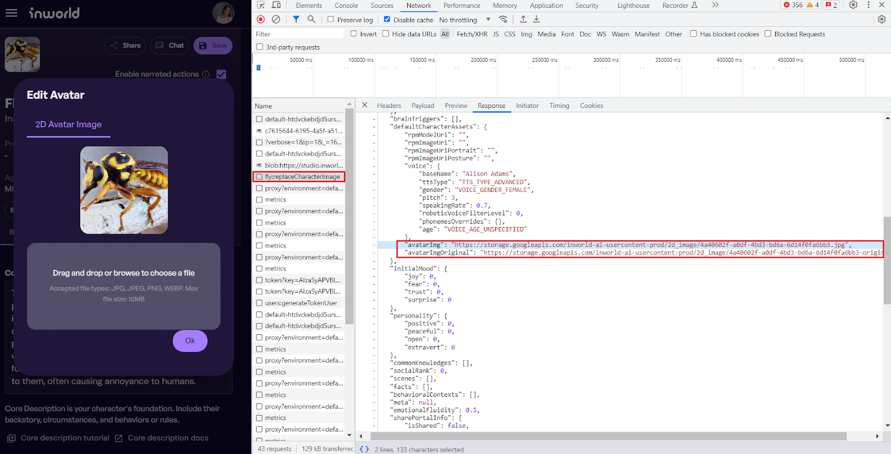
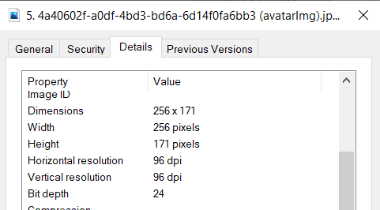
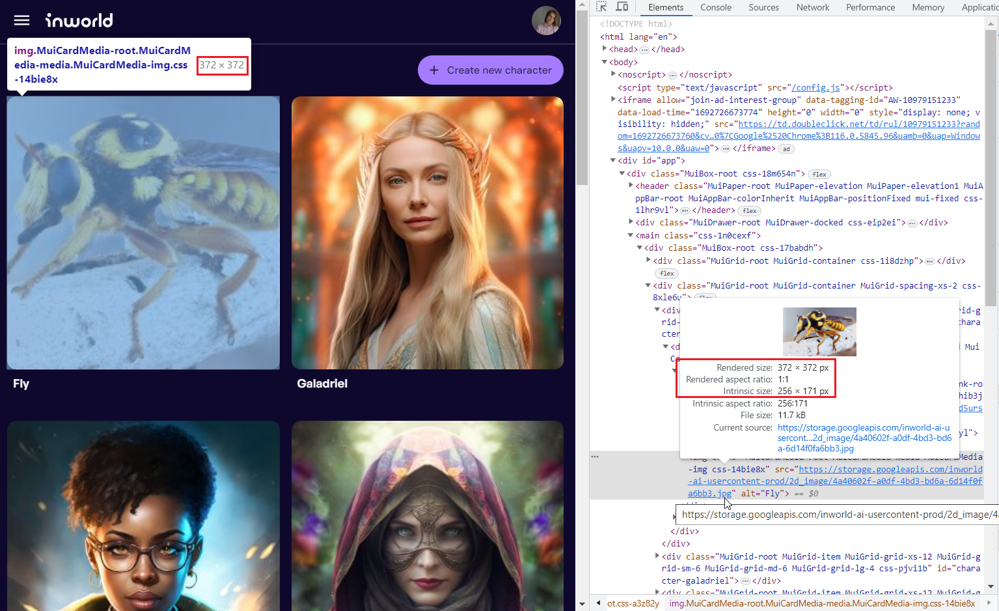

## #2 Quality of Avatar in the grid view

**ID:** IS-02

**Title:** The character's Avatar image update causes image blur  

**Module/Feature:** Edit Character / Edit Avatar (2D Avatar Image)

**Severity:** Low

### 2.1. Description

**Current Behavior:** After uploading some high-resolution images, such as 900x600 pixels as a 2D Avatar, you can see their quality degradation in the grid view on the Characters page. They contain the visual artifact as blocky and jagged patterns in the image or blurring:

**Expected Behavior:** If the user uploaded a good-resolution image for a 2D Avatar, the image quality in the grid view should still be acceptable. There should not be a strong pixelation effect.

Below is an example of an uploaded image with no visual compression artifacts:

**Reason for Suggestion:** The poor-quality of the character’s Avatar reduces the user's enjoyment of seeing their character list.

### 2.2. Steps to Reproduce

1. On the Characters page, select any character and click Edit.
2. On the Character’s edit page, move the mouse over the character image and click Edit.
3. In the Edit Avatar window on the "2D Avatar Image" tab, choose the file [fly.jpeg](fly.jpeg) and click Ok.
4. Click item Characters on the right menu for viewing the character's list.
5. Find the character from Step 1 and look at the Avatar image with visual compression artifacts.

### 2.3. Additional Notes

This happens when images are over-compressed and then enlarged.

**Example**

The initial test image’s resolution is 900х600 pixels ([fly.jpeg](fly.jpeg)).

Uploaded image saved in the storage in a lower resolution 256х171 pixels:

In the Сharacter list, the size of each card is various because of adaptive design, but it's bigger than the size of the resized image. In the screenshot below, it is 372x372 pixels. So now we need to upscale the 256x171 image to card size 372x372. At this point, it loses quality because the missing image information cannot be reached when enlarging the size:
