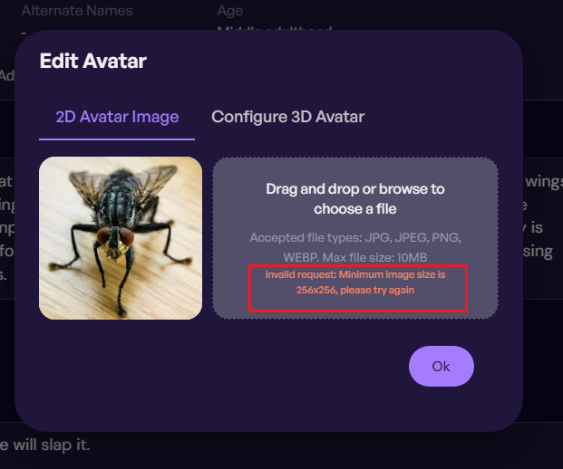
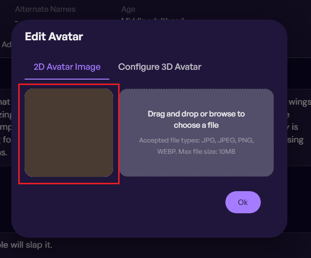
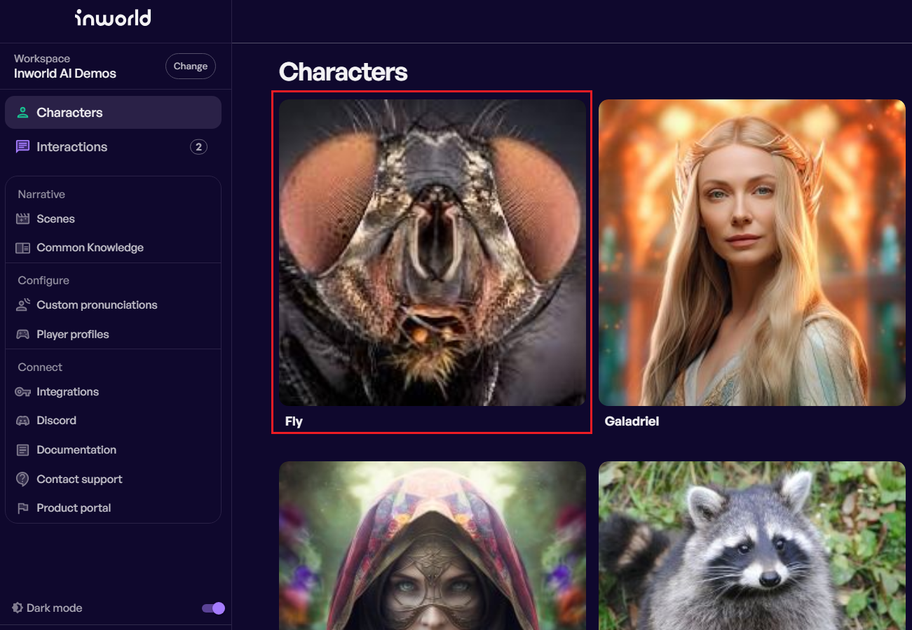

## #3 Limit the image size for Avatar

**ID:** IS-03

**Title:** The image size limit is applied to only one dimension 

**Module/Feature:** Edit Character / Edit Avatar (2D Avatar Image)

**Severity:** 3-Medium

### 3.1. Description

**Current Behavior:** According to the specification, users cannot upload an image as a 2D Avatar that has a size less than 225x225 pixels, they get a warning message “*Minimum image size is 256x256, please try again*”. For example, for a 225x225 image:

In that case both sizes are less than 256 pixels.

But users can successfully upload an image, which has only one side within the range of the allowable size. For example, for a 256x1 image:

**Expected Behavior:** It is expected that when selecting an image where one side is smaller than the allowable size, the user will get an invalid size message and won't be able to upload this image.

**Reason for Suggestion:**  
1. This issue is important because it affects the system. The goal is to deny unexpected data to get into the system. Keeping images like 256x1 and wasting resources to handle them might be useless.

2. The user may upload an image smaller than acceptable and get a poor-quality Avatar with the compression artifacts. For example, for a 256x191 image:

### 3.2. Steps to Reproduce

1. On the Characters page, select any character and click Edit.
2. On the Character’s edit page, move the mouse over the character image and click Edit.
3. In the Edit Avatar window on the "2D Avatar Image" tab, choose the file [225x225_error.jfif](225x225_error.jfif).
4. You’ll get the warning message “*Minimum image size is 256x256, please try again*”. It’s right.
5. Then choose the file [256x1_no_error.jfif](256x1_no_error.jfif).This image will be successfully uploaded. Although you should have gotten the same warning message.

### 3.3. Possible Solutions
Check all sides of the uploaded image for minimum size, both length and width.