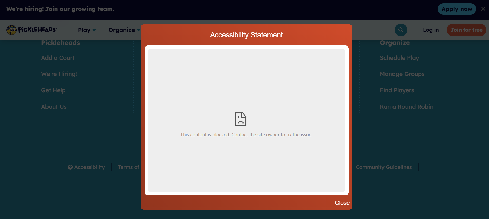

## #1 Accessibility Features Blocked

**ID:** PH-01

**Title:** Accessibility Statement/Feedback Blocked & Causes Page Freeze 

**Module/Feature:** Accessibility

**Severity:** High (Blocks access to essential accessibility features and breaks page interaction)

**Summary:**
When attempting to access the "Accessibility Statement" or "Send Feedback" features from the Accessibility panel on pickleheads.com, the content fails to load due to a _Content Security Policy (CSP)_ violation. Instead, a generic error message "This content is blocked..." is displayed:

Furthermore, after closing this broken modal/frame, the main page content becomes unresponsive, specifically preventing scrolling, and requiring a page refresh to restore normal interaction.

**Steps to Reproduce:**
1. Navigate to https://www.pickleheads.com/ using a modern web browser (e.g., Chrome, Firefox, Edge).
2. Scroll down to the footer of the page.
3. Locate and click the "Accessibility" link.
4. Observe the accessibility panel/widget that opens (typically appears on the right side of the screen).
5. Locate and click the "Accessibility Statement" link or the "Send Feedback" link at the bottom of the panel.
6. Observe the modal window or frame that appears, attempting to load the statement/feedback content. Note the error message displayed within it.
7. Close the modal window or frame containing the error message by clicking a 'Close' button or outside the modal area.
8. Attempt to scroll the main page content up or down.
9. (Optional but recommended) Open the browser's Developer Tools (usually by pressing F12) and navigate to the "Console" tab before step 5 to capture the initial CSP error when the statement/feedback link is clicked.

**Expected Result:**
The Accessibility Statement content or the Send Feedback form, provided by equalweb.com, should load successfully within the designated frame/modal.

After closing the modal/frame (whether it loaded successfully or not), the main page should remain fully interactive, allowing normal scrolling and interaction without needing a refresh.

**Actual Result:**
1. The frame/modal displays the error message: "This content is blocked. Contact the site owner to fix the issue" (on the browsers Google Chrome and Brave).

2. The browser's Developer Tools Console logs a Content Security Policy error similar or identical to the following:
`Refused to frame 'https://access.equalweb.com/' because it violates the following Content Security Policy directive: "frame-src 'self' https://js.stripe.com https://checkout.stripe.com https://*.doubleclick.net https://*.termly.io https://*.typeform.com https://*.vimeo.com https://*.mydupr.com https://*.dupr.com https://*.metabaseapp.com https://calendly.com https://challenges.cloudflare.com https://www.figma.com https://www.googletagmanager.com https://www.youtube.com https://youtu.be https://www.infaq.ai/".`

3. Users are unable to access the accessibility information or provide feedback through this channel.

4. After closing the modal/frame containing the error message, the main page freezes. Specifically, scrolling the page becomes impossible.
To regain the ability to scroll and interact fully with the page, the user must manually refresh the page (F5) or navigate away.

**Root Cause Analysis:**
_Initial Blocking:_ The website (`pickleheads.com`) sends an HTTP `Content-Security-Policy` header with a `frame-src` directive that does not include `https://access.equalweb.com`. This causes the browser to block the frame content.

_Subsequent Freeze (Hypothesis):_ The script handling the modal/frame dismissal might not be correctly cleaning up event listeners, removing overlays, or restoring the page's state, potentially due to an error path triggered by the blocked content. This leaves the page in a state where scrolling or other interactions are captured or disabled.

**Suggested Solution:**
_Primary Fix (CSP):_ The web development or operations team for `pickleheads.com` needs to modify the website's Content Security Policy configuration on the server. Specifically, `https://access.equalweb.com` needs to be added as an allowed source to the `frame-src` directive.

_Secondary Fix (Scripting)_: Investigate the TypeScript code responsible for managing the accessibility modal/frame. Ensure that the dismissal logic correctly handles scenarios where the frame content fails to load (due to CSP or other errors) and properly restores the background page's scrollability and interactivity. Error handling around the `iframe` loading might be necessary.

**User Impact:**
- This issue prevents users, particularly those relying on accessibility features or needing to report accessibility barriers, from accessing critical information and feedback mechanisms.
- The subsequent page freeze significantly disrupts the user experience for anyone who clicks the accessibility button, forcing them to refresh the page to continue browsing the site. This could lead users to abandon the site or become frustrated.

Please investigate both the CSP configuration and the modal dismissal script to resolve these issues. Fixing the CSP is the priority to unblock the content, but addressing the freeze is crucial for general site usability.

