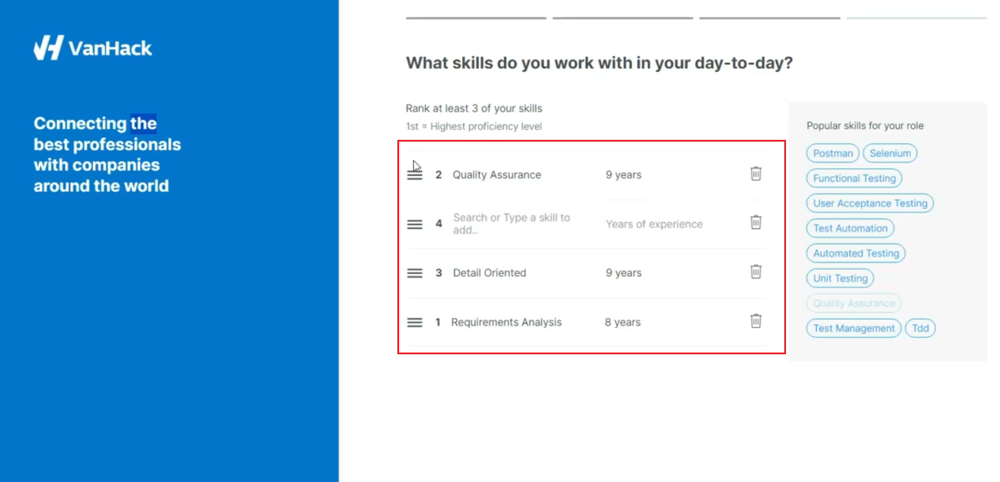

**ID:** VH-01

**Title:** Dragged skills list items move in a chaotic order.

**Module/Feature:** Creating a profile / Skills list  

**Severity:** 2-High

**Description:** When filling out a list of skills, the user must rank them according to priority. But here a problem occurs. When the user drags and drops items in the list, that or neighbouring items may move in random, unexpected directions, for example:

Thus, it will take patience and time for the user to sort the list in the correct order. For example, it took me ~1.5 minutes to sort a list of three items: [VIDEO](Sorting_of_the_skills_list.mp4)

**Steps to reproduce:**

1. Start creating a profile on https://vanhack.com/.
2. On the skills list page, add 3 of any skills.
3. Try to drag and drop the third item of the list on the first position.

**Expected result:** This item moved to the first position. The other elements remained in the same place. 

**Actual result:** This item moved randomly and unexpectedly. Additionally, other elements may have moved as well.