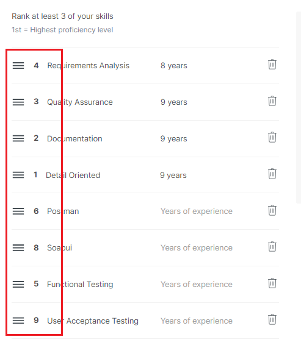

**ID:** VH-02

**Title:** The numbering of moved items in the skills list is not recalculated.

**Module/Feature:** Creating a profile / Skills list  

**Severity:** 3-Medium

**Description:** When the user drags and drops items in the list of skills, the numbering is not updated and becomes  inconsistent:

**Steps to reproduce:**

1. Start creating a profile on https://vanhack.com/.
2. On the skills list page, add 4 of any skills.
3. Move fourth item from the list on the first position.

**Expected result:** The list numbering is updated, and the item's number is '1'. The user sees an ordered list of skills 1, 2, 3, 4.

**Actual result:** The item number remained '4'. The user sees an unordered list of skills 4, 1, 2, 3.

**Possible Solutions:** It is possible to remove element numbering if the requirements specification allows it.