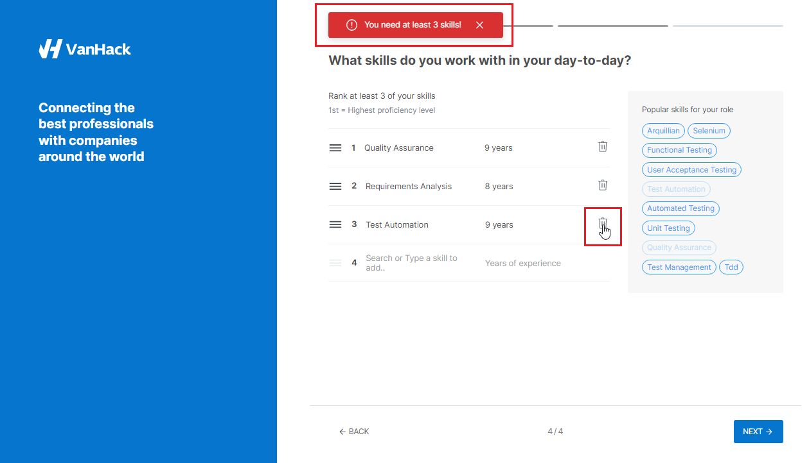

**ID:** VH-03

**Title:** Error deleting an item from the skills list when there are 3 items.

**Module/Feature:** Creating a profile / Skills list  

**Severity:** 3-Medium

**Description:** When editing a skills list, the user cannot delete an item from the list that contains exactly three skills:

An error occurs because the user must have at least 3 skills to create a profile.  

This behavior is not comfortable. User cannot delete unnecessary skill directly. He must look for workarounds: either edit the name of an existing skill or add one more item and then delete this one, for example [VIDEO](Delete_items_from_the_skills_list.mp4).

**Steps to reproduce:**

1. Start creating a profile on https://vanhack.com/.
2. On the skills list page, add 3 of any skills.
3. Try to delete the third item from the list.

**Expected result:** This item was successfully deleted.

**Actual result:** Error message: *"You need at least 3 skills!"*

**Possible Solutions:** Check for three items not when editing the list but only when trying to go to the next page.