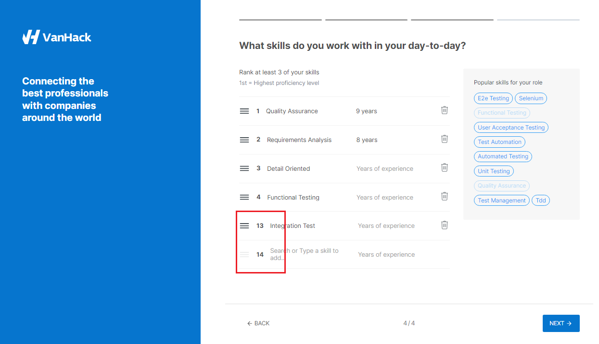

**ID:** VH-04

**Title:** Auto-numbering of new skills list items includes the numbers of previously deleted items.

**Module/Feature:** Creating a profile / Skills list  

**Severity:** 4-Low

**Description:** If you create a new skill list item after deleting other items from that list, the new item is created with the sequence number following the last deleted item, although it should be next in order after the last remaining item. Thus, the user sees a non-sequential numbering of the list.

For example, if you delete items 5-12 in a list of 12 items and then add a new item, its number will be 13 instead of 5: 

**Steps to reproduce:**

1. Start creating a profile on https://vanhack.com/.
2. On the skills list page, add 4 of any skills.
3. Delete the fourth item from the list.
4. Add a new skill.

**Expected result:** The new skill number will be 5.

**Actual result:** The new skill number should be 4.